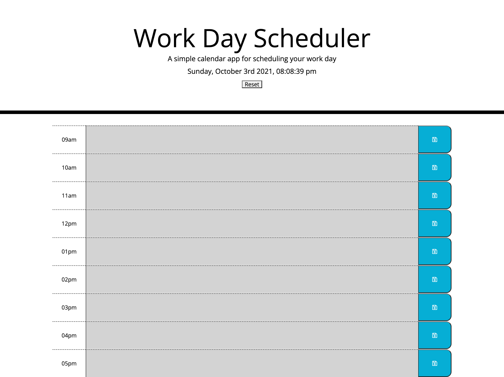

# DayPlanner
The objective of this assignemt is to create a daily planner for an employee who wants to manage their time more effectively by adding and saving important events to a daily planner during work hours, 9am to 5pm.

# Criteria
- When the user opens up the daily planner, the current day is displayed atr the top of the calendar.
- As the user scrolls they are presented with timeblocks for standard business, 9am-5pm.
- Each timeblock is color coded to indicate whether it is in the past, present, or future.
- Upon clicking a timeblock, the user is able to enter an event and click the save button.
- The event is then saved in local storage and when the page is refreshed the saved events persist. 

# Screenshot

# Deployed Link

[Link to Project on GitHub Pages ](https://mlh19.github.io/DayPlanner/)

# Other Details 
- Worked on assignment independently.

- Seeked help from an outside tutor for assistance to understand the meridiem logic.

- Used an example provided by a peer in the class to format moment.js

- Used the gif provided by instructor in the README.

- https://www.w3schools.com/bootstrap/ 

- https://www.youtube.com/watch?v=jjyesTGCzgU&feature=youtu.be 

- https://www.youtube.com/watch?v=jjyesTGCzgU&feature=youtu.be

